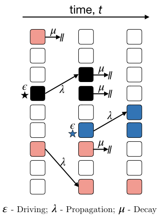

# neuron-minimal
Simulation and analysis code for the minimal neuron model. 

## Abstract of the Project: "Unifying criticality and the neutral theory of neural avalanches"

The distribution of collective firing of neurons, known as a neural avalanche, obeys a power law. Three proposed explanations of this emergent scale-free behavior are criticality, neutral theory, and self-organized criticality. We study a model of the brain for which the dynamics are governed by neutral theory. We find that the scale-free behavior is controlled by the proximity to a critical point. Our results unify the neutral theory of neural avalanches with criticality, which requires fine tuning of control parameters, and rule out self-organized criticality. By using tools from percolation theory, we characterize the critical properties of the neural avalanches. We identify the tuning parameters, which are consistent with experiments, and show that scale-free neural avalanches occur only at the critical point. The scaling hypothesis provides a unified explanation of the power laws which characterize the critical point. The critical exponents characterizing the avalanche distributions and divergence of the response functions are shown to be consistent with the predictions of the scaling hypothesis. We use an universal scaling function for the avalanche profile to find that the firing rate for avalanches of different sizes shows data collapse after appropriate rescaling. Critical slowing-down and algebraic relaxation of avalanches demonstrate that the dynamics are also consistent with the system being at a critical point. We discuss how our results can motivate future empirical studies of criticality in the brain.

Publication: Physical Review Research 3, 013107 (2021).

## Model description

The neutral model of neurons consists of $N$ neurons which are fully connected. Every neuron interacts with every other neuron. Each neuron can be either inactive, $I$, or active $A_k$, where the index $k$ denotes the avalanche label. In the Figure, different colors correspond to different causally-connected avalanches. The stochastic dynamics of the avalanches are described by rate equations. A new avalanche with a new label is triggered at the _driving rate_, $\epsilon$. An avalanche increases in size at the _propagation rate_, $\lambda$, as inactive neurons are triggered by active neurons. Active neurons become inactive at the _decay rate_, $\mu$. The rate equations describing the NMN~\cite{MNM_OP} are 
\begin{align}
	I & \xrightarrow[]{\epsilon}  A_{{\rm max}[k]+1}
	\\
	I + A_k & \xrightarrow[]{\lambda}  A_{k} + A_{k}
	\\
	A_k & \xrightarrow[]{\mu}  I
\end{align}
An avalanche ends when all neurons with a given label $k$ become inactive. The avalanche size $S$ is the number of activations and the avalanche duration $D$ is the time between the activation of the first neuron with label $k$ to when all neurons with index $k$ become inactive. 

